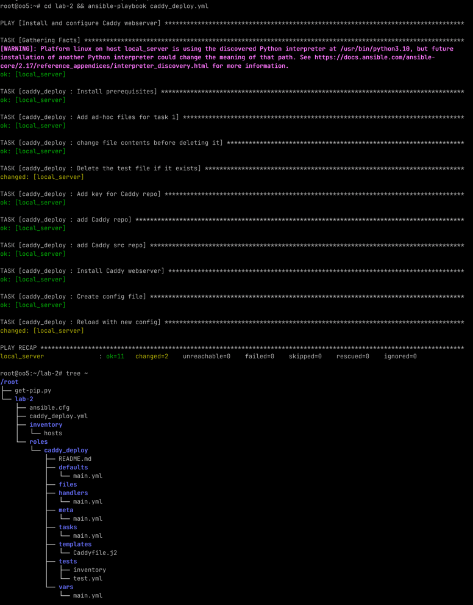

# Лабораторная работа 2

## Ansible + Caddy

## Задачи

1) Переписать пример с созданием и удалением файла из шага 5 части 1 с ad-hoc команд на
   плейбук формат,
   а так же добавить четвертый шаг - перед удалением поменять содержимое файла на любое
   другое.
2)
    1) "Расширить" конфиг вебсервера Caddy любым функционалом по желанию:
       Например, добавить проксирование, или какие-нибудь заголовки (header). Вместо
       дефолтной
       страницы Caddy подставить свою, хотя бы index.html с Hello world внутри. Добавить
       это в
       качестве дополнительного шага в tasks
    2) сделать всю работу на удаленном сервере, а не на одном и том же localhost


## Ход работы

### Задача 1

Я отредактировал предложенный ansible playbook и добавил 3 шага: 
- создание файла
- редактирование файла
- удаление файла

Я применил 2 разных подхода к манипулированию файлами в ansible: 
- ansible.builtin.shell
- ansible.builtin.file

Вот текст получившихся тасков

```yaml
- name: Add ad-hoc files for task 1
  ansible.builtin.shell:  # используем простые sh команды
    cmd: "echo test_file_content > {{ ansible_env.HOME }}/test.txt"
  args:
    creates: "{{ ansible_env.HOME }}/test.txt"
  when: ansible_env.HOME is defined  # если существует переменная HOME

- name: change file contents before deleting it
  ansible.builtin.shell:
    cmd: "echo altered_text_for_file > {{ ansible_env.HOME }}/test.txt"
    # Опять простые sh команды, чтобы отработать
  args:
    creates: "{{ ansible_env.HOME }}/test.txt"
    # creates тут подходит лучше всего, так как файл все еще существует после редактирования
  when: ansible_env.HOME is defined

- name: Delete the test file if it exists
  # Попробовал другой подход с манипуляций файлами при помощи ansible.builtin.file
  ansible.builtin.file:
    path: "{{ ansible_env.HOME }}/test.txt"
    state: absent
  when: ansible_env.HOME is defined
```

ansible.builtin.shell позволяет очень легко выполнить определенные задачи, но в этом 
случае сложнее отслеживать состояние системы, а следовательно, можно нарушить принцип 
идемпотентности.  

ansible.builtin.file гораздо лучше подходит для этой задачи, так как он придерживается 
декларативной природы ansible. 

### Задача 2


### Результаты



### Получившийся tasks/main.yml

```yml
- name: Install prerequisites
  apt:
    pkg:
    - debian-keyring
    - debian-archive-keyring
    - apt-transport-https
    - curl


# Задание 1

- name: Add ad-hoc files for task 1
  ansible.builtin.shell:  # используем простые sh команды
    cmd: "echo test_file_content > {{ ansible_env.HOME }}/test.txt"
  args:
    creates: "{{ ansible_env.HOME }}/test.txt"
  when: ansible_env.HOME is defined  # если существует переменная HOME

- name: change file contents before deleting it
  ansible.builtin.shell:
    cmd: "echo altered_text_for_file > {{ ansible_env.HOME }}/test.txt"
    # Опять простые sh команды, чтобы отработать
  args:
    creates: "{{ ansible_env.HOME }}/test.txt"
    # creates тут подходит лучше всего, так как файл все еще существует после редактирования
  when: ansible_env.HOME is defined

- name: Delete the test file if it exists
  # Попробовал другой подход с манипуляций файлами при помощи ansible.builtin.file
  ansible.builtin.file:
    path: "{{ ansible_env.HOME }}/test.txt"
    state: absent
  when: ansible_env.HOME is defined


# Задание 2
- name: Add key for Caddy repo
  apt_key:
    url: https://dl.cloudsmith.io/public/caddy/stable/gpg.key
    state: present
    keyring: /usr/share/keyrings/caddy-stable-archive-keyring.gpg

- name: add Caddy repo
  apt_repository:
    repo: "deb [signed-by=/usr/share/keyrings/caddy-stable-archive-keyring.gpg] https://dl.cloudsmith.io/public/caddy/stable/deb/debian any-version>
    state: present
    filename: caddy-stable

- name: add Caddy src repo
  apt_repository:
    repo: "deb-src [signed-by=/usr/share/keyrings/caddy-stable-archive-keyring.gpg] https://dl.cloudsmith.io/public/caddy/stable/deb/debian any-ver>
    state: present
    filename: caddy-stable

- name: Install Caddy webserver
  apt:
    name: caddy
    update_cache: yes
    state: present


- name: Create config file
  template:
    src: templates/Caddyfile.j2  # Откуда берем
    dest: /etc/caddy/Caddyfile  # Куда кладем

- name: Reload with new config
  service:
    name: caddy
    state: reloaded
```