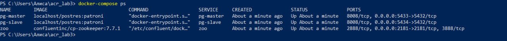
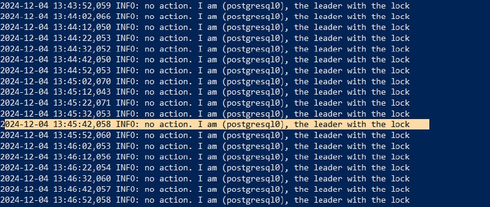
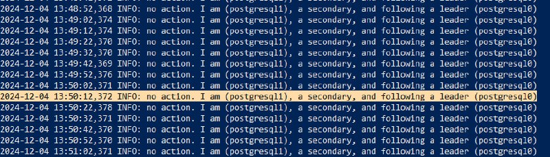
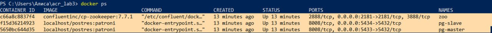

# ЛР 3. HA Postgres Cluster

**Задача:**
Развернуть и настроить высокодоступный кластер Postgres.

## Часть 1. Поднимаем Postgres

1. Создали директорию проекта, зашли в нее через Powershell, и создали там dockerfile.
2. Создали compose файл.
3. Создали postgres0.yml и postgres1.eml файлы.
4. Задеплоили

.jfif)
.jfif)





## Часть 2. Проверяем репликацию

Для упрощения дальнейших проверок и избежания проблем с фаерволом при внешних
подключениях, мы перенесли всю лабораторную на виртуальную машину. Пришлось установить
docker и docker-compose, но ничего не поменялось. Мы заново произвели

```bash
docker-compose up -d
docker-compose ps 
```

По итогу мы получили 3 работающих контейнера. Далее мы подключились к master и slave
базам данных и проверили репликацию и доступ к записи.

**Созданная таблица реплицировалась с мастера на слэйв и унаследовала вставленные данные**


**pg-slave выдает ошибку при попытке записи данных**


## Часть 3. Делаем среднего роста высокую доступность

Мы добавили в `docker-compose.yml` блок для haproxy, который сел на (традиционный для
бд) порт 5432. Далее мы создали конфиг файл (занятно, что он не работал, пока мы не
добавили новую пустую строку в конце файла) и перезапустили docker-compose. При
подключении я создал новую таблицу, заполнил ее и проверил репликацию на обоих узлах.

**Таблица отображается на всех 3 подключениях**


**Внесли и прочитали данные из таблицы**


Все конфигурационные файлы можно посмотреть в папке files, это копия файлов с 
удаленного сервера. 

## Ответы на вопросы:

1) *Порты 8008 и 5432 вынесены в разные директивы, expose и ports. По сути, если записать
   8008 в ports, то он тоже станет exposed. В
   чем разница?*

- Порты, вынесенные в expose, доступны только для других контейнеров, а вынесенные в
  ports доступны извне.

2) *При обычном перезапуске композ-проекта, будет ли сбилден заново образ? А если
   предварительно отредактировать файлы
   postgresX.yml? А если содержимое самого Dockerfile? Почему?*

- Нет, во всех случаях образ не будет сбилден заново, потому что образы в docker
  кэшируются для оптимизации.
